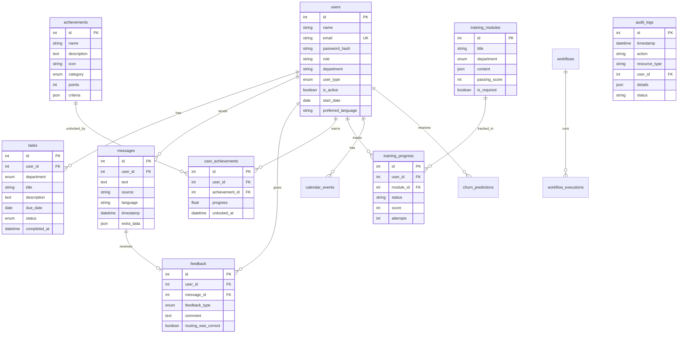

# Enterprise Onboarding Copilot - Visual Diagrams

This file contains Mermaid diagrams for the Enterprise Onboarding Copilot system. These diagrams can be viewed:

1. **GitHub/GitLab**: Renders automatically when viewing markdown files
2. **VS Code**: Install "Markdown Preview Mermaid Support" extension, then press `Cmd+Shift+V`
3. **Online**: Paste into [mermaid.live](https://mermaid.live) to view and export

---

## Table of Contents

1. [High-Level System Architecture](#1-high-level-system-architecture)
2. [Data Flow Architecture](#2-data-flow-architecture)
3. [LangGraph Multi-Agent State Machine](#3-langgraph-multi-agent-state-machine)
4. [RAG Hybrid Retrieval Pipeline](#4-rag-hybrid-retrieval-pipeline)
5. [Query Processing Pipeline](#5-query-processing-pipeline)
6. [Authentication Flow](#6-authentication-flow)
7. [Multi-Level Caching Architecture](#7-multi-level-caching-architecture)
8. [Entity Relationship Diagram](#8-entity-relationship-diagram)
9. [Internationalization Architecture](#9-internationalization-architecture)
10. [Request Lifecycle](#10-request-lifecycle)

---

## 1. High-Level System Architecture

```mermaid
flowchart TB
    subgraph Presentation["PRESENTATION LAYER<br/>Next.js 14 + React 18 + TailwindCSS"]
        Chat[Chat Interface]
        Tasks[Tasks List]
        Training[Training Modules]
        Calendar[Calendar View]
        Achievements[Achievements]
        Admin[Admin Dashboard]
    end

    subgraph API["API LAYER<br/>FastAPI + Middleware Stack"]
        subgraph Middleware[Middleware]
            CORS[CORS]
            RateLimit[Rate Limit]
            JWTAuth[JWT Auth]
            RBAC[RBAC]
            PII[PII Redact]
            Audit[Audit Logging]
        end
        subgraph Endpoints[API Endpoints]
            AuthAPI[/auth]
            ChatAPI[/chat]
            TasksAPI[/tasks]
            TrainingAPI[/training]
            AdminAPI[/admin]
            AuditAPI[/audit]
        end
    end

    subgraph Service["SERVICE LAYER"]
        subgraph QueryPipeline[Query Processing Pipeline]
            QueryRewrite[Query Rewrite]
            CacheCheck[Cache Check]
            IntentDetect[Intent Detect]
            MLRoute[ML Route]
            Escalation[Escalation]
        end
        subgraph MultiAgent[Multi-Agent System - LangGraph]
            Coordinator[Coordinator]
            HRAgent[HR Agent]
            ITAgent[IT Agent]
            SecurityAgent[Security Agent]
            FinanceAgent[Finance Agent]
            ProgressAgent[Progress Agent]
        end
        subgraph RAG[RAG Pipeline]
            SemanticSearch[Semantic Search<br/>ChromaDB]
            BM25Search[BM25 Search]
            RRF[RRF Fusion]
            LLMGen[LLM Generation]
        end
    end

    subgraph Data["DATA LAYER"]
        SQLite[(SQLite<br/>Structured Data)]
        ChromaDB[(ChromaDB<br/>Vectors)]
        MLflow[(MLflow<br/>ML Models)]
    end

    Presentation --> API
    API --> Service
    Service --> Data
```

---

## 2. Data Flow Architecture

```mermaid
flowchart TB
    subgraph Frontend["FRONTEND (Next.js 14)"]
        Components[React Components]
        APIClient[API Client]
        Fetch[HTTP Fetch]
        Components --> APIClient --> Fetch
    end

    subgraph Backend["BACKEND (FastAPI)"]
        MW[Middleware]
        Routes[Routes]
        Services[Services]
        Agents[Agents]
        RAGPipe[RAG]
        LLM[LLM]
        MW --> Routes --> Services --> Agents --> RAGPipe --> LLM
    end

    subgraph DataStores["DATA STORES"]
        SQLite[(SQLite<br/>• Users<br/>• Tasks<br/>• Messages<br/>• Audit Logs)]
        ChromaDB[(ChromaDB<br/>• Embeddings<br/>• Documents<br/>• Metadata)]
        MLflow[(MLflow<br/>• Router Model<br/>• Experiments<br/>• Metrics)]
    end

    Fetch -->|REST API| MW
    Backend --> SQLite
    Backend --> ChromaDB
    Backend --> MLflow
```



---

## 3. LangGraph Multi-Agent State Machine


---

## 4. RAG Hybrid Retrieval Pipeline

```mermaid
flowchart TD
    Query["USER QUERY<br/>'How do I submit an expense report?'"]
    
    Query --> Parallel
    
    subgraph Parallel["PARALLEL SEARCH EXECUTION"]
        direction LR
        subgraph Semantic["SEMANTIC SEARCH (ChromaDB)"]
            Embed[1. Embed query<br/>768-dim vector]
            VectorSim[2. Vector similarity]
            SemanticTopK[3. Return top-K]
            Embed --> VectorSim --> SemanticTopK
        end
        
        subgraph BM25["KEYWORD SEARCH (BM25)"]
            Tokenize[1. Tokenize query]
            TFIDF[2. TF-IDF scoring]
            BM25TopK[3. Return top-K]
            Tokenize --> TFIDF --> BM25TopK
        end
    end
    
    SemanticTopK --> Fusion
    BM25TopK --> Fusion
    
    subgraph Fusion["RECIPROCAL RANK FUSION (RRF)"]
        Norm1[1. Normalize semantic scores 0-1]
        Norm2[2. Normalize BM25 scores 0-1]
        Combine["3. Combined = 0.7×semantic + 0.3×BM25"]
        Dedup[4. Deduplicate by hash]
        Sort[5. Sort descending]
        Norm1 --> Norm2 --> Combine --> Dedup --> Sort
    end
    
    Fusion --> Chunks
    
    Chunks["TOP-5 DOCUMENT CHUNKS<br/>Relevant policy excerpts"]
    
    Chunks --> LLMGen
    
    subgraph LLMGen["LLM GENERATION (GPT-4o-mini)"]
        System[System: Department instructions]
        Context[Context: Retrieved documents]
        User[User: Original query]
        Response[Generate grounded response]
        System --> Context --> User --> Response
    end

    style Query fill:#E3F2FD,color:#000
    style Response fill:#C8E6C9,color:#000
```



---

## 5. Query Processing Pipeline


---

## 6. Authentication Flow


---

## 7. Multi-Level Caching Architecture


---

## 8. Entity Relationship Diagram



---

## 9. Internationalization Architecture


---

## 10. Request Lifecycle


---

## Agent Communication Flow


---

## Churn Prediction Score Calculation

```mermaid
flowchart LR
    subgraph Inputs["INPUT METRICS"]
        TC[Task Completion<br/>30%]
        AF[Activity Frequency<br/>25%]
        LP[Learning Progress<br/>20%]
        CE[Chat Engagement<br/>15%]
        FS[Feedback Sentiment<br/>10%]
    end
    
    subgraph Calculation["WEIGHTED CALCULATION"]
        Formula["Overall Score =<br/>TC×0.30 + AF×0.25 +<br/>LP×0.20 + CE×0.15 + FS×0.10"]
    end
    
    subgraph Output["RISK LEVEL"]
        Low["LOW (65-100)<br/>🟢"]
        Medium["MEDIUM (45-65)<br/>🟡"]
        High["HIGH (25-45)<br/>🟠"]
        Critical["CRITICAL (0-25)<br/>🔴"]
    end
    
    Inputs --> Calculation --> Output

    style Low fill:#4CAF50,color:#fff
    style Medium fill:#FFEB3B,color:#000
    style High fill:#FF9800,color:#fff
    style Critical fill:#f44336,color:#fff
```



---

## Achievement System Flow


---

## How to View These Diagrams

### Option 1: GitHub / GitLab
Simply push this file to your repository. GitHub and GitLab automatically render Mermaid diagrams.

### Option 2: VS Code
1. Install extension: **"Markdown Preview Mermaid Support"**
2. Open this file
3. Press `Cmd+Shift+V` (Mac) or `Ctrl+Shift+V` (Windows)

### Option 3: Mermaid Live Editor
1. Go to [mermaid.live](https://mermaid.live)
2. Copy any diagram code (between the ```mermaid and ``` markers)
3. Paste to visualize and export as PNG/SVG

### Option 4: Export to PNG/SVG
Use the Mermaid CLI:
```bash
npm install -g @mermaid-js/mermaid-cli
mmdc -i DIAGRAMS.md -o diagrams/
```

---

*These diagrams complement the [Technical Report](TECHNICAL_REPORT.md) with visual representations of system architecture and data flows.*

